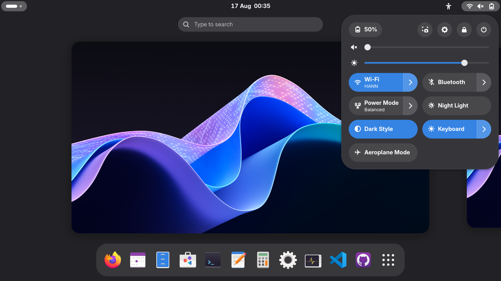
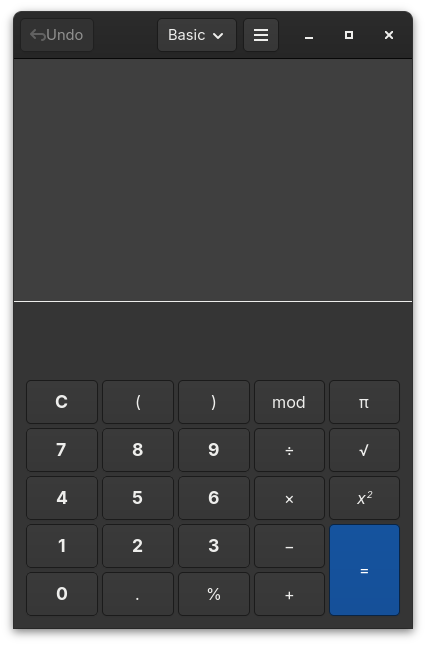
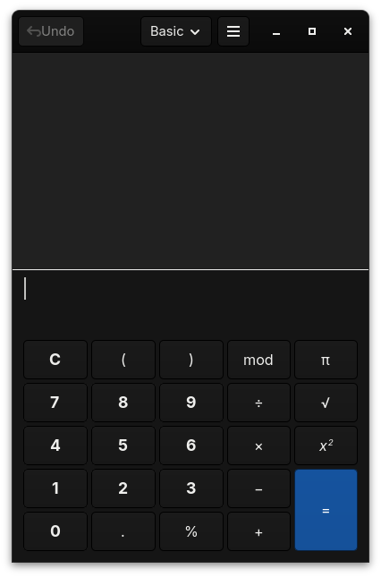

A stock-like theme aiming to improve looks and usability, based on Adwaita.

## Install

1. Install the [Sass](https://sass-lang.com/install) compiler if you haven't already, e.g.

   ```bash
   # Run one of these...
   dart pub global activate sass
   npm install -g sass
   sudo dnf install sass
   ```

2. Install these gnome extensions:
   - [User Themes](https://extensions.gnome.org/extension/19/user-theme/): used to theme the system (gnome shell).
   - [Night Theme Switcher](https://extensions.gnome.org/extension/2236/night-theme-switcher/): used to switch between light and dark variants of this theme.

3. Run `make install` to build and install the theme.

## Scripts

This project downloads the stock theme from Gnome's repositories, modifies a couple colors, then compiles it to CSS.

The following actions are available (but `make install` runs all necessary steps in one command):
- `make download`: Downloads the stock theme from Gnome's repositories.
- `make patch`: Applies the color changes to the downloaded theme.
- `make build`: Compiles the scss files to css.
- `make install`: Copies the theme to `~/.local/share/themes/` and enables it.
- `make clean`: Deletes patched files ready for a fresh build but keeps downloaded stock themes.
- `make purge`: Deletes all build files included downloaded stock themes.

## Screenshots

Gnome Shell, Adwaita vs Bdwaita:



GTK 4 Apps like Gnome Calculator, Adwaita vs Bdwaita:

 