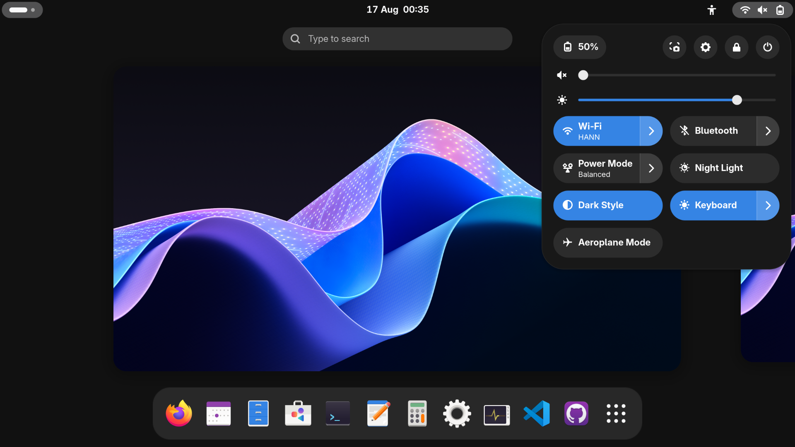

A gnome shell theme with darker backgrounds.

## Install

1. Install the [Sass](https://sass-lang.com/install) compiler if you haven't already, e.g.

   ```bash
   # Run one of these...
   dart pub global activate sass
   npm install -g sass
   sudo dnf install sass
   ```

2. Install the [User Themes](https://extensions.gnome.org/extension/19/user-theme/) extension if you haven't already.

3. Run `make install` to build and install the theme.

## Scripts

This project downloads the stock theme from Gnome's repositories, modifies a couple colors, then compiles it to CSS.

The following actions are available (but `make install` runs all necessary steps in one command):
- `make download`: Downloads the stock theme from Gnome's repositories.
- `make patch`: Applies the color changes to the downloaded theme.
- `make build`: Compiles the scss files to css.
- `make install`: Copies the theme to `~/.local/share/themes/` and enables it.
- `make clean`: Deletes the build files.

## Screenshots

Stock gnome shell theme:


Modified theme:

